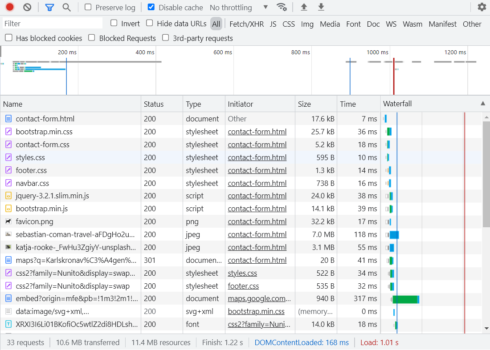
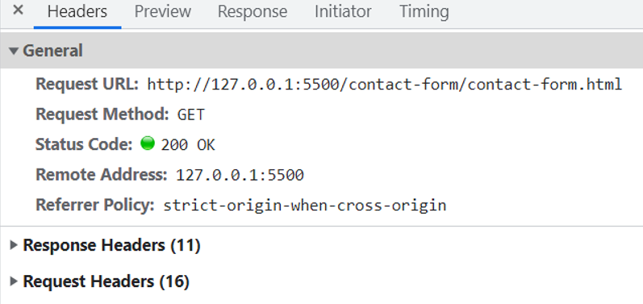
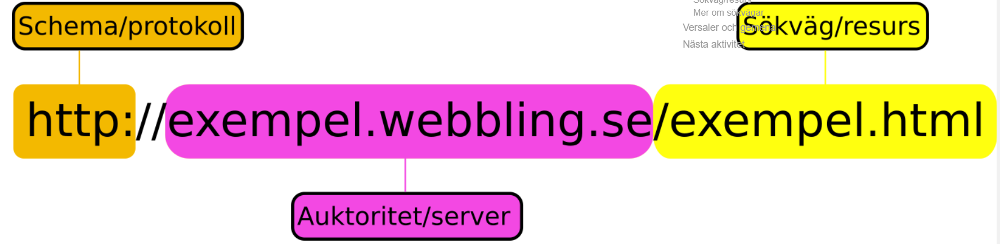
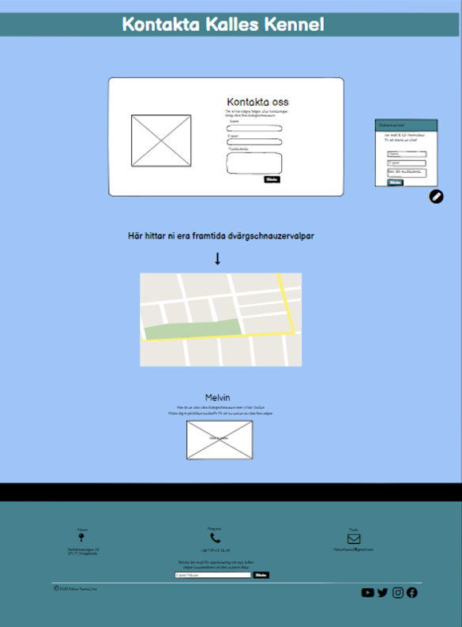

# Projekt rapport

### Innehållsförtecking
#####  SEO
#####  Inspector verktyget
#####  URL
#####  Reflektion

## SEO 

***Skriv vilka nyckelord ni valde och vad du gjort för SEO på ditt ansvarsområde.***

 Vi valde nyckelorden dvärgschnauzer och kennel. Den SEO som jag gjort på mitt ansvarsområde ligger inne i footern och på kontaktsidan. 
 På  footern är kennel med två gånger, ena stället är vid copyright och andra vid mejlen. 
 Den SEO jag gjort inne på kontaktsidan är att jag har med dvärgschnauzer tre gånger och kennel vid rubriken.

## Inspector verktyget

***Använd bilder från Inspector verktyget och förklara i grova lag hur webbläsaren använder http för att besöka just din hemsida.***

Den börjar med att hämta contact-form.html (index filen). Sedan skickar den en request för att hämta nästa sak. 
Så den hämtar bootstrap.min.css och contact-form.css och så fortsätter det så tills allting är hämtat och uppladdat. 
Det tog lite över 1 sekund innan allting laddades upp. 

## URL 

***Förklara varför just den  URL som används  i HTTP anropet ovan används. (Använd ord som: schema/protokoll, auktoritet/server/domän, sökväg/resurs.***

Den första delen i URL:n (http:) visar vilket schema/protokoll som ska användas för att behandla resursen i fråga. 
Det är ett speciellt protokoll för dataöverföring och är mest tänkt att användas för att överföra webbsidor, det går dock med annan information också.
Schema-delen av URL:n visar hur man ska få tag på den resurs man är ute efter. Det finns olika sätt man kan göra det på och ett schema behöver inte vara ett protokoll.
Mailto är t.ex inte ett protokoll.

Den del som kommer sen i URL:n är t.ex ”KallesKennel.se”. Den anger vilken auktoritet som kan tillhandahålla resursen. 
Den talar om för webbläsaren varifrån den kan hämta resursen. Det som skrivs där är oftast ett domännamn(en internetadress). 
Ett domännamn är en typ av internetadress som måste översättas till en numerisk IP-adress innan man kan hämta resursen. 
För det används ett DNS som är som en telefonkatalog för internet, det blir lättare komma ihåg ett domännamn än en IP-adress. 

Den sista delen i URL:n säger vilken resurs på servern man är ute efter, alltså vad man vill få tag på.
Det är en sökväg som säger till servern var den ska hitta resursen och vad den heter.
Sökvägens första slash-tecken ”/” i (/exempel.html) säger att resursen finns i webbserverns rot. 
Serverkonfigurationen pekar ut en specifik katalog som webb-rot , som man lägger sina webbresurser i. 
Så när man använder slash ”/” talar man om till webbservern att den ska kolla högst upp i filkatalogen som konfigurerats som webb-rot.

## Reflektion

***Självständigt reflektera över och kritiskt granska de valda lösningarna i projektet gällande design och wireframes, HTML, CSS, samt Bootstrap.***

Vi bestämde en text font och några färger vi skulle hålla oss till när vi designa hemsidan. 
Det var skönt att det var bestämt, så att man kunde experimentera lite mellan färgerna vi hade valt mellan. 
Jag tror man sparade lite tid på det, sen känns det som att hemsidan blev mer enhetlig när vi alla använde oss av samma färger. 
Jag tror också att vi kollade lite på varandra för att försöka få en så enhetlig design på hemsidan som möjligt, men att man ändå kände att man kunde designa som man ville. 
Det hände även att man frågade varandra om råd och tips, jag kommer ihåg att jag hade hittat två olika bootstraps exempel på kontaktformulär. 
Så då rådfrågade jag om vilken dom tyckte verkade passa bäst in i hemsidan. Det var skönt att kunna rådfråga ibland och det formade ju även designen. 

Vi började kolla på bootstrap hyfsat tidigt under projektarbetet, vilket gjorde att man började arbeta med det i projektet. 
Jag kollade runt på getbootstrap.com & använde mig av ett exempel därifrån för att påbörja footern. Sedan fick man ändra i HTML kod och lägga till i CSS:n. 
Jag gick även in på andra sidor som använde sig av bootstrap 5 och hittade t.ex. en chatbubbla som jag använde mig av. 
Sen försökte man style:a om den med färger och få den att passa in med resten av designen man gjorde på sin sida.

När det kommer till wireframes, så gjorde jag det inne på balsamiq. Man fick ändra lite då och då på sin wireframe då man ibland kom på något nytt att lägga till på sin sida.
Wireframens design formades efter hur man hade designat hemsidan eftersom man gjorde den först. Det var kul och gick smidigt att använda sig utav balsamiq.
Överlag så är jag nöjd med vårt samarbete/lösningar till projektarbetet/designen på hemsidan. Det har vart kul att jobba tillsammans med Hanna, Klara och Shekim!

